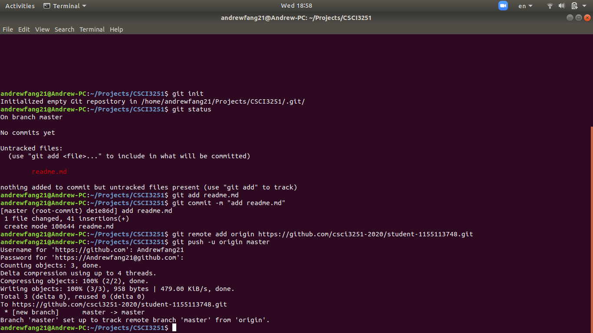

# CSCI3251 Milestone #2

## Self Introduction
Hi all, I am __Andrew Fanggara__ and I am a sophomore majoring Computer Science. My college is _Chung Chi_ but I live in ~~International House~~ my own house due to coronavirus :((

## My Experiences
Programming languages that I have used so far:
* C/C++
* Golang <3
* Java
* ~~Javascript~~ Typescript
* Python
* Dart
* Pascal

## Github

Although I have used Github for almost a year, I am not really fluent in it. Probably because the commands that I used are simple ones :(

## Wish List During Quarantine Lockdown
- [X] Finished watching Season 4 of Money Heist :D
- [ ] Finished doing CSCI3100 Project :(
- [ ] Finished reading Head First Design Pattern book
- [X] Sleeping Late
- [X] Watch Youtube more often <3
- [X] Skip classes

## Courses That I Take This Semester
I took a total of 17 credits this semester:D.
Course Code | Course Title
------------|--------------
CSCI3100 | Software Engineering
ENGG2430 | Probability and Statistics for Engineers
ESTR2102 | Data Structures
CSCI3250 | Computer and Society
CSCI3251 | Engineering Practicum
ELTU2014 | English for Engineering Students I
UGED2080 | Appreciation of Western Classical Music

## Screenshot

